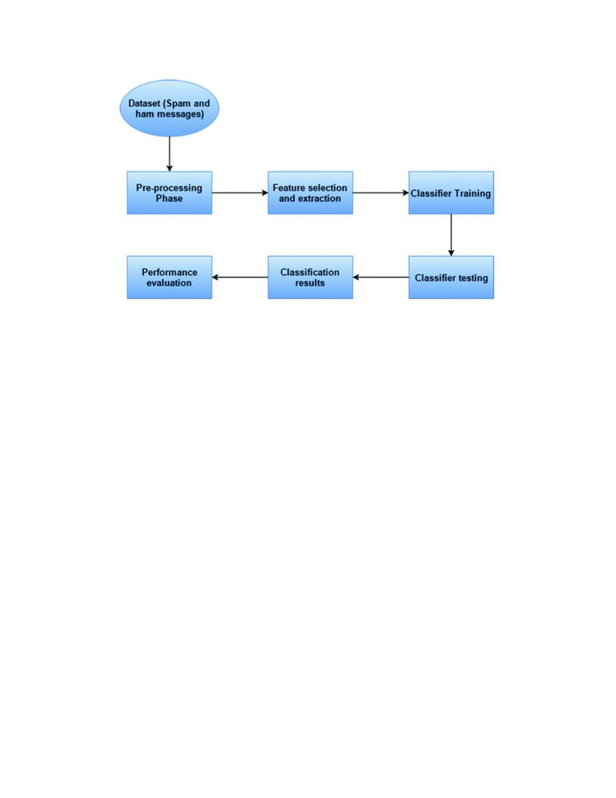

# **Spam Detection with Naive Bayes**

This project demonstrates how to build a spam detection model using Naive Bayes. The dataset used in this project is the Spam SMS Collection from the [UCI Machine Learning Repository](https://archive.ics.uci.edu/ml/datasets/sms+spam+collection).

# **Description**

The SMS Spam Collection v.1 (hereafter the corpus) is a set of SMS tagged messages that have been collected for SMS Spam research. It contains one set of SMS messages in English of 5,574 messages, tagged acording being ham (legitimate) or spam. 

# **Requirements**

To run this project, you will need the following:
1. Python 3.x
2. Jupyter Notebook
3. scikit-learn
4. pandas
7. nltk

# **Accuracy**
| Text Preprocessing Type              | Multinomial NB |
|--------------------------------------|----------------|
| TFIDF Vectorizer + PorterStemmer     | 97.30%         | 
| CountVectorizer + PorterStemmer      | 98.56%         |
| CountVectorizer + WordnetLemmatizer  | 98.29%         | 
| TFIDF Vectorizer + WordnetLemmatizer | 97.48%         |

# **Workflow**

